# Subhash Kashyap

**CS Undergraduate · NIT Rourkela `2024–2028`**  
Research Intern · ISI Bangalore, SSIU Lab · Dr. Saroj K. Meher

---

## Research

Broadly into computer vision and deep learning, with a recurring focus on how classical spectral phenomena show up in neural network behavior.

**[Spectral Mamba](https://github.com/Subkash2206/spectral-mamba-analysis)**  
Spectral audit of VM-UNet (Visual Mamba) against Swin-Tiny and UNet-ResNet50 on ISIC2018 dermoscopy segmentation (N=519). Introduced AVR (Alias Violation Ratio) with DC correction to test whether Mamba's Selective Scan mechanism introduces aliasing artifacts that explain boundary segmentation deficits. Finding: hypothesis not supported. Uncovered a dual-stage spectral fingerprint — Mamba front-loads high-frequency energy at Stage 1 (AVR 0.46 vs. CNN baseline 0.34), then aggressively self-corrects by Stage 4 (AVR 0.13, lowest of the three). The previously reported AVR-BF1 correlation (r ≈ −0.50) was entirely an intensity bias artifact; pooled r = +0.0108 (p = 0.670) after DC correction.

**[Brain Tumor Segmentation · MIDL 2026](https://github.com/Subkash2206/aliasing-tumor-boundaries)**  
Applied AVR to boundary quality analysis in 3D MRI segmentation on BraTS 2021 using SegResNet. Small-effect negative result and a counterintuitive shift consistency drop (98% → 91%). Baseline Dice 83.03%, BF1 72.60%.

**[Spectral Aliasing in CNNs](https://github.com/Subkash2206/spectral-aliasing-cnns)**  
Introduced SIS (Shift Instability Score) alongside AVR on STL-10. BlurPool cuts mean SIS by ~39.8%, but BlurPool networks compensate by learning higher pre-blur AVR — spectral debt doesn't disappear, it relocates. Preprint in progress.

---

## Contact

[subhashkashyap2206@gmail.com](mailto:subhashkashyap2206@gmail.com) · [github.com/Subkash2206](https://github.com/Subkash2206)

Into deep learning and computer vision.
